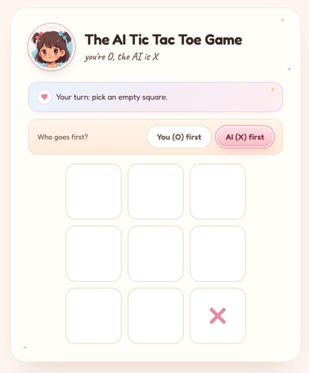

# Tic Tac Toe with FastAPI and Reinforcement learning

This is a reinforcement learning-based Tic Tac Toe game. The code accelerates learning by updating the values of 8 symmetrical state-action pairs (Identity + 3 90-degree rotations, flip_lr, flip_ud, flip along two diagonal axes) at once. We have also included a FastAPI web app for a graphical user interface.

## Installation

```bash
git clone https://github.com/inteli5/tictactoe.git
```

With [uv](https://docs.astral.sh/uv/) installed, run the following in the project root. It creates `.venv` and installs the locked dependencies (including `pytest` for development):
```bash
uv sync
```
The commands below use `uv run`, which runs them inside that environment. To run the tests:
```bash
uv run pytest
```


## Usage


### Web App

In the root directory of the project, run the following command in the terminal:
```bash
uv run tictactoe_webapp.py
```
After that, open a web browser and enter the URL 127.0.0.1:8000.
You will always be 'O' and the AI will always be 'X'.
By default, the AI moves first. However, you can click the button "You (O) first" to move first.



### Training

The two JSON files, 'q_table_ubuntu_agent_move_first.json' and 'q_table_ubuntu_agent_move_second.json', are the pre-trained agents. Each file maps a board state to the Q-values of its moves, for example `{"000000000": {"0,0": 0.78, "0,1": 0.77, ...}}`, where "row,col" is the cell of the move. The Q-tables are stored as JSON rather than pickle, because loading a pickle file can run arbitrary code.

You can also train your own agents by backing up the JSON files and running the following command:

```bash
uv run training_agent_that_move_first.py
```

This will train the first mover agent by playing with a random opponent. No JSON file is needed.

And run
```bash
uv run training_agent_that_move_second.py
```
This will train the second mover agent by playing with a AI opponent that uses the JSON file 'q_table_ubuntu_agent_move_first.json'.

After training your own agent, you can test it by running the following codes that let the AI agent plays with another AI agent.
To test the first mover agent, you can run,
```bash
uv run agent_play_with_agent_test_first_mover_agent.py
```
To test the second mover agent, you can run,
```bash
uv run agent_play_with_agent_test_second_mover_agent.py
```
If you set the parameters correctly, your agents should never lose. In the test above, the opponent agent (the agent not being tested) may not always make optimal moves. If both agents make optimal moves, they will always draw. The opponent always plays an immediate winning move when it has one; otherwise the opponent agent chooses the move (see `make_opponent_move()` in 'game_and_agent.py'). To control whether the opponent agent makes optimal moves, you can use the is_learning flag (False means optimal move). For instance, in the 'agent_play_with_agent_test_first_mover_agent.py' file:
```python
make_opponent_move(game, agent1, is_learning=False)
```

The file 'game_and_agent.py' contains the classes for the TicTacToe game and the reinforcement learning agent. We assign rewards of (1, 0, -1) for win, draw, and loss, respectively. Additionally, we apply a small negative reward of -0.1 for every step. Since each episode is relatively short, we set the discount factor gamma to 1, although 0.9 could also be used. To expedite the learning process, we update not only the current state-action pair but also its symmetrical state-action pairs. As an example, below is a portion of the q-table for the second mover agent.

{('000020000', (0, 1)): -0.6744205096465703,

 ('000020000', (1, 0)): -0.6744205096465703,

 ('000020000', (2, 1)): -0.6744205096465703,

 ('000020000', (1, 2)): -0.6744205096465703,

 ('000020000', (0, 0)): -0.09080339631767263,

 ('000020000', (2, 0)): -0.09080339631767263,

 ('000020000', (2, 2)): -0.09080339631767263,

 ('000020000', (0, 2)): -0.09080339631767263}

'000020000' represents the current state of the board, indicating that the opponent (always 2) has made the first move by placing their piece in the center of the board. An action is represented by a tuple, such as (0, 1). The first four actions correspond to the four edges of the board, which all have the same q-value. The next four actions correspond to the four corners of the board.

If the AI agent chooses to make their moves on the edges, they are guaranteed to lose, and therefore these actions have a lower q-value. If the AI agent chooses to make their moves on the corners, it is possible to achieve a draw.

## License

[MIT](https://choosealicense.com/licenses/mit/)