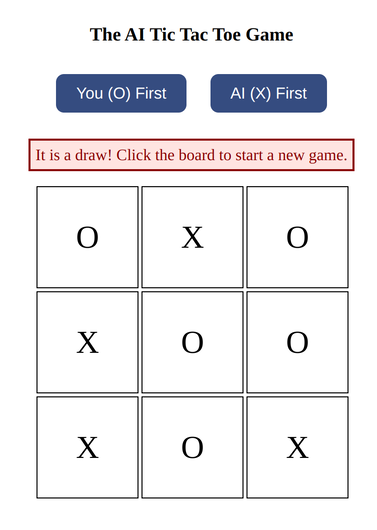

# Tic Tac Toe with FastAPI and Reinforcement learning

A Reinforcement learning based Tic Tac Toe game. The code accelerates learning by updating 8 symmetrical (Identity + 3 90-rotation, flip_lr, flip_ud, flip along two diagonal axis) state-action's value at once. We also include a FastAPI web app for GUI.

## Installation

```bash
git clone https://github.com/inteli5/tictactoe.git
```
create a virtual environment by, for example, 

```bash
conda create -n tictactoe python=3.10

```

```bash
conda activate tictactoe
```


Install required packages.
```bash
python -m pip install -r requirements.txt
```


## Usage


### Web App

In the root directory of the project,
```bash
python tictactoe_webapp.py
```
Then you can open a web browser and input the URL 127.0.0.1:8000
You are always 'O'. AI is always 'X'.
By default, AI move first. You can click the button "You (O) first" to move first.



### Training

The two pkl files are the pre-trained agent.

You can also train your own first mover agent by backing up the pkl files and run
```bash
python training_agent_that_move_first.py
```
This program trains a first mover agent by playing with a random opponent. No pkl file is needed.

Train the second mover agent by running
```bash
python training_agent_that_move_second.py
```
This program requires the pkl file 'q_table_ubuntu_agent_move_first.pkl', because it trains a second mover agent by playing with an AI opponent who use this q-table.

After training your own agent, you can test it by running the following codes that let the AI agent plays with another AI agent.
To test the first mover agent, you can run,
```bash
python agent_play_with_agent_test_first_mover_agent.py
```
To test the second mover agent, you can run,
```bash
python agent_play_with_agent_test_second_mover_agent.py
```
If you set the parameters well, your agents should never lose. 
In the above test, the opponent agent (the agent not being tested) will not always make optimal moves. 
If both agents take the optimal moves, they will always draw.
To control whether the opponent agent makes optimal move, you can use the is_learning flag. False means optimal move.
For example, the 'agent_play_with_agent_test_first_mover_agent.py', line 78
```python
agent1_action = agent1.choose_action(
    agent1_state_key, game.get_valid_actions(), is_learning=False)
```

The file 'game_and_agent.py' includes the TicTacToe game and reinforcement learning agent class. 
We use reward (1,0,-1) for win, draw, and lose.
Every step we use a small negative reward -0.1.
For the discount factor gamma we used 1 because each episode is relatively short. 0.9 should also work. 
We accelerate the learning by updating not only the current state-action but also the symmetrical state-action pairs.
For example, here is part of the second mover agent q-table.

{('000020000', (0, 1)): -0.6744205096465703,

 ('000020000', (1, 0)): -0.6744205096465703,

 ('000020000', (2, 1)): -0.6744205096465703,

 ('000020000', (1, 2)): -0.6744205096465703,

 ('000020000', (0, 0)): -0.09080339631767263,

 ('000020000', (2, 0)): -0.09080339631767263,

 ('000020000', (2, 2)): -0.09080339631767263,

 ('000020000', (0, 2)): -0.09080339631767263}

'000020000' is the board state. It means that the opponent (always 2) moves first and place in the center of the board. Tuple like (0, 1) is the action. You can see that the first four actions are the four edges. They share the same q-value. The next four actions are the four corners. 
If the AI agent chooses the four edges, it will be sure to lose. So they share a lower q-value.
if the AI agent chooses the four corners, we can have a draw.

## License

[MIT](https://choosealicense.com/licenses/mit/)